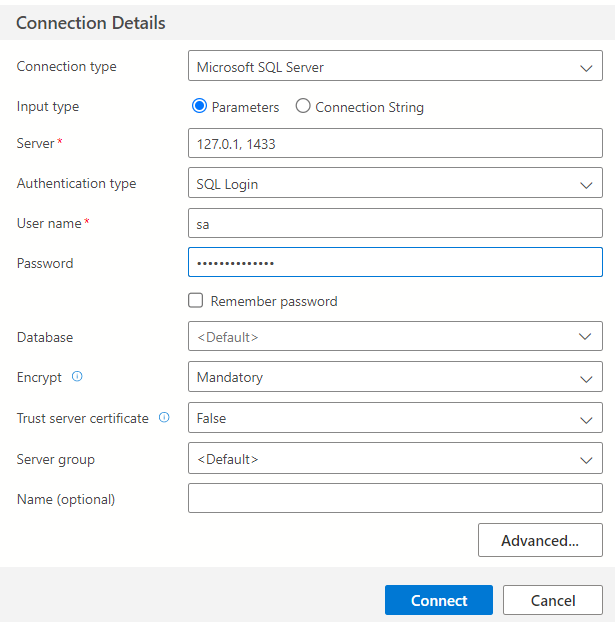

## Running SQL server on docker container

The example below shows how to run the SQL server on the docker container for tests while developing a new application.

### 1. Start docker
### 2. Create image

```
docker build -t my-sql-server .
```
### 3. Create container

```
docker run -p 1433:1433 --name my-sql-server my-sql-server .
```

## Install Azure Data Studio

1. Download and run the Azure Data Studio user installer

1. Start the Azure Data Studio app.

1. Click on the new connection and fill in the fields:



